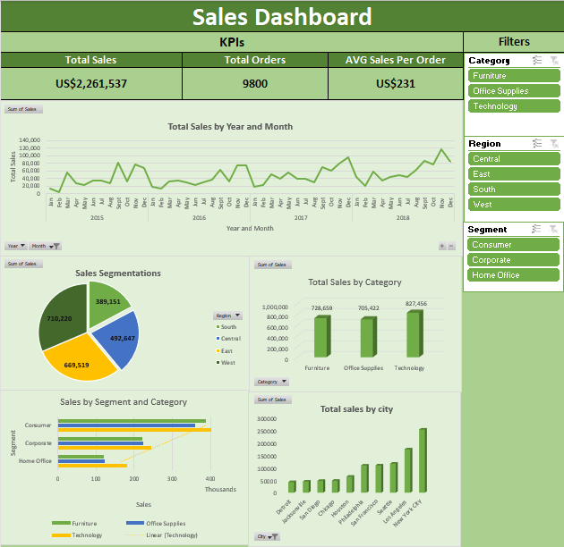

# 📊 Sales Dashboard – Elevvo Internship Task

This repository contains a **Sales Dashboard** built using **Excel** as part of the **Elevvo Internship Program**.  
The dashboard provides key insights into sales performance across categories, regions, customer segments, and time.

---

## 🚀 Features
- ✅ **KPIs**:  
  - Total Sales: **US$2,261,537**  
  - Total Orders: **9800**  
  - Average Sales per Order: **US$231**  

- 📈 **Sales Trend**: Monthly sales over time (2015–2018)  
- 🥧 **Sales Segmentations**: Visual breakdown by customer segments  
- 🛒 **Category Insights**: Sales comparison across Furniture, Office Supplies, and Technology  
- 🌍 **Regional View**: Sales distribution across Central, East, South, and West  
- ⭐ **Top Cities**: Highlight of the highest sales-performing cities  

---

## 🖼️ Dashboard Preview

---

## 🛠️ Tools Used
- **Microsoft Excel**  
  - Pivot Tables  
  - Pivot Charts  
  - Filters  
  - Dashboard Formatting & Design  

---

Explore the Dashboard sheet and interact with slicers/filters.

✨ About
This project was created during the Elevvo Internship to showcase skills in:

Data Analysis

Dashboard Design

Business Insights Visualization
